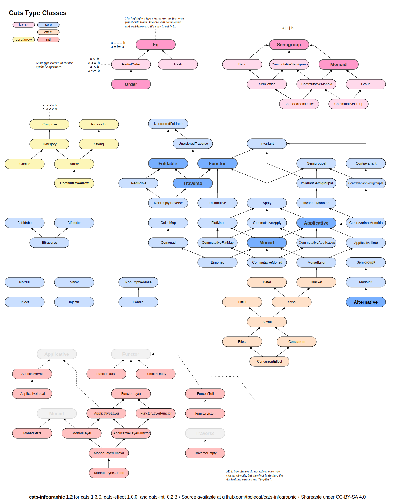

# Herding CATS

book source: [Scala with CATS](https://underscore.io/books/scala-with-cats/)

web source: [herding cats](http://eed3si9n.com/herding-cats/)

cats exercises: [Scala Cats exercises](https://www.scala-exercises.org/cats)

my study note: [CatsStudyNote](docs/CatsStudyNote.md)

## Content

### theory

[README](src/main/scala/com/github/jacobbishopxy/theory/README.md)

### herding cats

[README](src/main/scala/com/github/jacobbishopxy/herdingCats/README.md)

## Note

- pure:

    `A => F[A]`

- map:

    `(F[A], A => B) => F[B]`

- flatMap:

    `(F[A], A => F[B]) => F[B]`

- product:

    `(F[A], F[B]) => F[(A, B)]`

- ap:

    `(F[A], F[A => B]) => F[B]`
    

Monad type class hierarchy:

```

Cartesian            Functor
(product)             (map)
    |___________________|
              |
            Apply
            (ap)
     _________|_________
    |                   |
Applicative          FlatMap
  (pure)            (flatMap)
    |___________________|
              |
            Monad
```

Cats type class view:

thanks to tpolecat's [project](https://github.com/tpolecat/cats-infographic)


